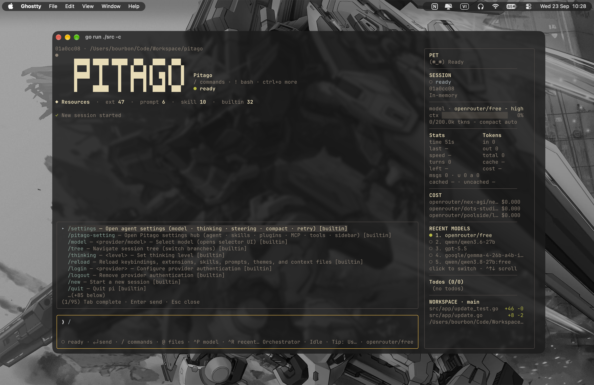
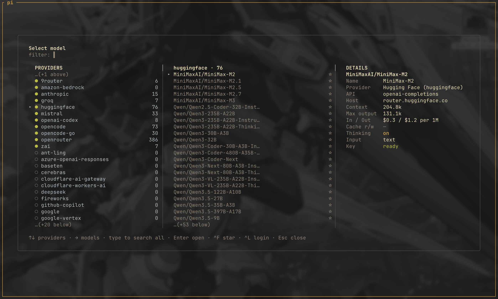
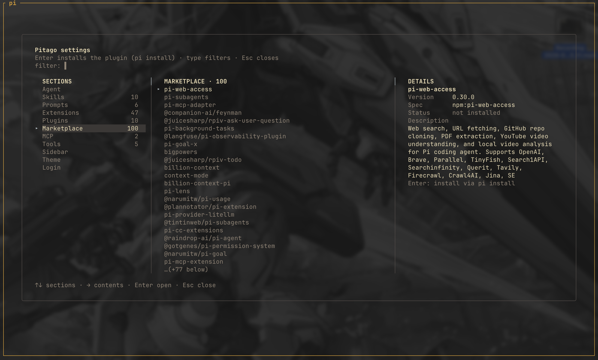

<div align="center">

</div>

<div align="center">

https://github.com/user-attachments/assets/93bfcae4-b02e-429d-a302-d2df850f71a7

[](https://github.com/cavaldos/pitago/releases/latest)
[](https://github.com/cavaldos/pitago/releases)
[](https://github.com/cavaldos/pitago/stargazers)
[](https://github.com/cavaldos/pitago/network/members)
[](LICENSE)
[](https://ko-fi.com/calvados)

<p align="center">
  <a href="#install"></a>
</p>

_A polished Terminal User Interface (TUI) frontend for the `pi` agent, built with Bubble Tea. `pi --mode rpc` serves as the backend (multi-provider, tools, sessions, compaction), while pitago provides a rich terminal interface communicating over JSONL._

</div>

## Screenshots

<div align="center">
  
  
  
  <br />
  
  
  
</div>


## Install

```bash
# macOS / Linux
curl -fsSL https://raw.githubusercontent.com/cavaldos/pitago/main/script/install.sh | bash

# Windows (PowerShell)
Invoke-WebRequest https://github.com/cavaldos/pitago/releases/latest/download/pitago-windows-amd64.exe -OutFile pitago.exe
```

From source:

```bash
git clone https://github.com/cavaldos/pitago.git
cd pitago
script/build.sh                      # outputs bin/pitago (VERSION defaults to git tag/commit)
mkdir -p ~/.local/bin && cp bin/pitago ~/.local/bin/pitago
pitago --version

script/run.sh                        # or: go run ./src
```

### Uninstall

| Platform | Command |
| -------- | ------- |
| macOS / Linux | `rm ~/.local/bin/pitago` (or `/usr/local/bin/pitago` if you installed with `sudo` before) |
| Windows | `del C:\path\to\pitago.exe` — wherever you placed it, on a folder in your PATH |
| Any (reset data) | `rm -rf ~/.config/pitago` / `Remove-Item -Recurse -Force $HOME\.config\pitago` — drops saved API keys + recent models |

## Quick Start

```bash
go run ./src                        # start in this directory
go run ./src ~/Code/workspace       # or open another directory (flags first)
go run ./src -c                     # resume the most recent session
go run ./src -ne                    # load no pi extensions (same as `pi -ne`)
go run ./src --update               # self-update to the latest GitHub release
```


## Commands &amp; keybindings

### Commands

Type `/` to open the command popup. Builtins are intercepted locally and re-implemented over
RPC; extension/prompt/skill commands come from pi's `get_commands` and run server-side.

| Command | Action |
| ------- | ------ |
| `/model` · `/recent` | Change model · recent models picker |
| `/yank` `/copy` `/copy-md` `/copy-tables` `/copy-code` | Copy the last assistant answer, whole or semantic |
| `/sidebar` · `/mouse [on\|off]` | Hide/show sidebar · toggle mouse (click + wheel) |
| `/theme [name]` | Switch theme — picker, or apply directly (`pitago --theme one-dark`) |
| `/pet [name\|ascii\|classic]` | Sidebar pet: picker dialog, or apply directly |
| `/plugins` | Collapse/expand installed pi plugins in the sidebar |
| `/thinking` | Toggle thinking level |
| `/mcp` | MCP server manager: add/remove servers, per-server login, tools, reconnect, exposure, enable/disable |
| `/tree` | Session tree with jump-to-message, copy entry, fork from here |
| `/trajectory [all\|tools\|messages]` | Harness-style run trace window |
| `/notification [filter]` | Notification history (time + info/error, newest first) |
| `/settings` | Agent settings, saved to `~/.pi/agent/settings.json` |
| `/pitago-setting` | Pitago hub: agent, skills, prompts, extensions, plugins, MCP, tasks, theme, login |
| `/login` · `/logout` | Manage API keys + pi OAuth/subscriptions |
| `/live` | Attach read-only to a running `pi` session |
| `/reload` | Reload extensions |
| `/new` · `/resume` · `/session` | New session · resume picker · session management |
| `/compact [instructions]` | Compact the context now (an LLM call, can take a while) |
| `/update` | Check GitHub releases and install the latest |
| `/quit` | Exit |

### Keybindings

| Key | Action |
| --- | --- |
| `Enter` | Send (idle) / steer (while running) |
| `Esc×2` | Cancel running turn (double-press within 3s — 1st press only arms) |
| `Ctrl+C` | Clear the input — text, a recalled message, the image tray; on an empty input, quit (press twice within 3s) |
| `Ctrl+N` | New session |
| `Ctrl+P` / `Ctrl+R` / `Alt+1…5` | Cycle model · recent-models picker · jump to a recent model |
| `Ctrl+T` | Cycle thinking level (no picker) |
| `Ctrl+E` | Hide/show sidebar (hide for clean drag-select of chat only) |
| `Ctrl+Y` / `Ctrl+O` | Yank last assistant answer · yank picker for any message |
| `Ctrl+V` | Paste text — or screenshot data (pngpaste/wl-paste/xclip) |
| `Ctrl+G` | Expand/collapse tool output: write content, read results, diffs |
| `Backspace` | Empty input + image tray → remove the last `[Image N]` chip |
| `↓` (+tray) | Cursor into the image tray · `←→` pick a chip · `⌫` delete it · `Esc` back to input |
| `Tab` | Complete `/command` or `@file` |
| `@` | Mention a file (fuzzy finder; `@*.png/.jpg/.gif/.webp` also sends vision) |
| `↑↓ PgUp PgDn` | Empty input: recall sent messages (`Esc` clear) · otherwise scroll chat |
| `Alt+…` or `Ctrl+↑↓ PgUp PgDn Home End` | Scroll the sidebar |
| `Mouse wheel` | Hover sidebar to scroll it, the chat otherwise; `--mouse=false` disables |

### Copying text and messages

<sub>▶ <a href="https://github.com/user-attachments/assets/35d59f05-45b7-407c-a212-552ca61c1b07">Video demo</a></sub>

| Action | How |
| ------ | --- |
| Drag-select | With mouse on (default): drag inside the chat — selection is clamped to the chat pane, edge auto-scrolls |
| Select a line | **Double-click** a chat line |
| Copy a block | **Right-click** an assistant block for `Copy markdown`, `Copy N code block(s)`, `Copy N table(s)`, `Copy plain text` — the menu only lists what the block contains |
| Mouse off | Native terminal selection; toggle at runtime with `/mouse off` |
| Last answer | `Ctrl+Y` / `/yank` / `/copy`, or `/copy-md` `/copy-tables` `/copy-code` for semantic content |
| Any message | `Ctrl+O` opens the yank picker |

Whole-message copy preserves raw Markdown, tables, fenced-code languages, and links; partial
drag selection copies visible text without ANSI/OSC sequences.

## Development

```bash
go vet ./...                    # vet
go build -o /tmp/pitago ./src  # build
go test ./...                  # test
script/test-cicd.sh             # what CI runs, locally first
```

A tag push cross-builds (linux-amd64, darwin-amd64/arm64, windows-amd64) and publishes a GitHub
Release: `script/release.sh v0.0.1`.

`app` is a thin MVC shell, `components` holds pure view primitives, `ext` and `pitago` are
separate pure domain layers, `builtin` is a command surface over RPC, and `pirpc`/`update` are
the backend edges. `script/check-layers.sh` enforces the one-way import graph.

## Docs

| Doc | What |
| --- | ---- |
| [resources/doc/ARCHITECTURE.md](resources/doc/ARCHITECTURE.md) | Directory map and the import rules |
| [resources/doc/CONFIGURATION.md](resources/doc/CONFIGURATION.md) | Every file under `~/.config/pitago/` |
| [resources/doc/LIVE-SESSION.md](resources/doc/LIVE-SESSION.md) | Attaching to a running `pi` session |
| [resources/doc/CONTRIBUTING.md](resources/doc/CONTRIBUTING.md) | Dev workflow, layers, tests |
| [docs/design.md](docs/design.md) | Design notes: why each decision looks the way it does |
| [docs/subagent-surface-hosts.md](docs/subagent-surface-hosts.md) | Subagent surface hosts |

## Star History

[](https://star-history.com/#cavaldos/pitago&Date)